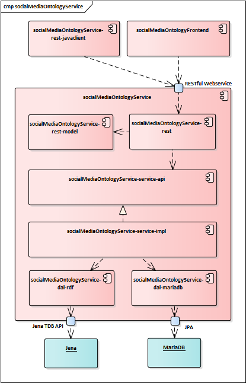

# socialMediaOntologyService
Service to manage ontologies of social media in rdf and relational structure. 

## Getting started
1. Check out Service
2. Edit properties for DB-Access
3. Build via: mvn clean install
4. Deploy: Service is dockerizable

## Documentation
Componentview on Prototype.

